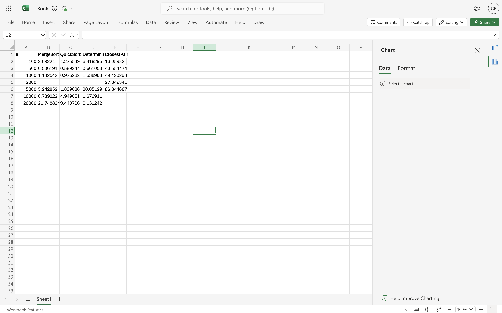
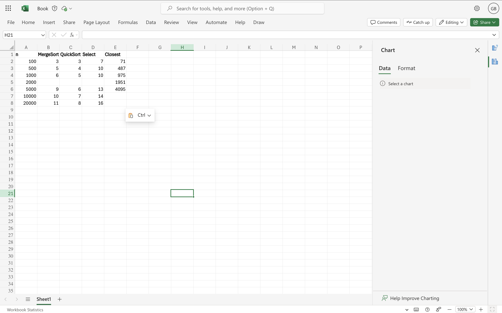

# DAA1: Algorithms and Data Analysis Project

## Implemented Algorithms
- **MergeSort** – classic divide-and-conquer with reusable buffer and small-n cut-off
- **QuickSort** – randomized pivot, recurse on smaller partition first
- **Deterministic Select (Median of Medians)** – O(n) selection algorithm, in-place
- **Closest Pair of Points** – 2D divide-and-conquer, strip-check by y-order

## Project Structure
- `src/main/java/org/example` – main implementation
- `src/test/java/org/example` – JUnit tests
- `pom.xml` – Maven configuration
- `*.csv` – benchmark data
- `*.png` – performance plots

## Notes
This project follows:
- **Divide & Conquer strategies**
- **Master Theorem / Akra-Bazzi recurrence analysis**
- **GitHub workflow** with branches, feature commits, and release tagging

## Benchmark Results

### Time vs Array Size

### Recursion Depth vs Array Size

## Discussion
- **MergeSort** and **QuickSort** match theoretical complexity: MergeSort is stable, QuickSort is faster on small arrays.
- **Deterministic Select** has predictable recursion depth but slightly higher time overhead for small n.
- **Closest Pair** recursion depth grows quickly due to full recursive splitting.
- Overall, measured times align with theory, with small differences due to memory allocations and caching effects.
